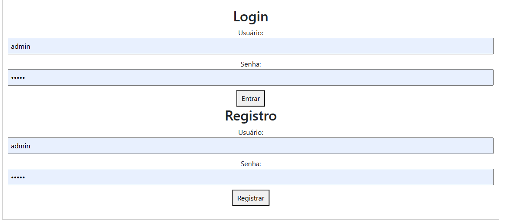

# User Authentication System with JavaScript and Bootstrap

This repository contains a simple user authentication system built using JavaScript and Bootstrap. The system allows users to register for an account, log in, and log out. It serves as a basic template for implementing authentication features in web applications.




## Features

- User Registration
- User Login
- User Logout
- Responsive Design with Bootstrap

## Technologies Used

- JavaScript
- HTML
- CSS
- Bootstrap

## Getting Started

To run the application locally, follow these steps:

1. Clone the repository:

   ```bash
   git clone https://github.com/your-username/authentication-system.git
